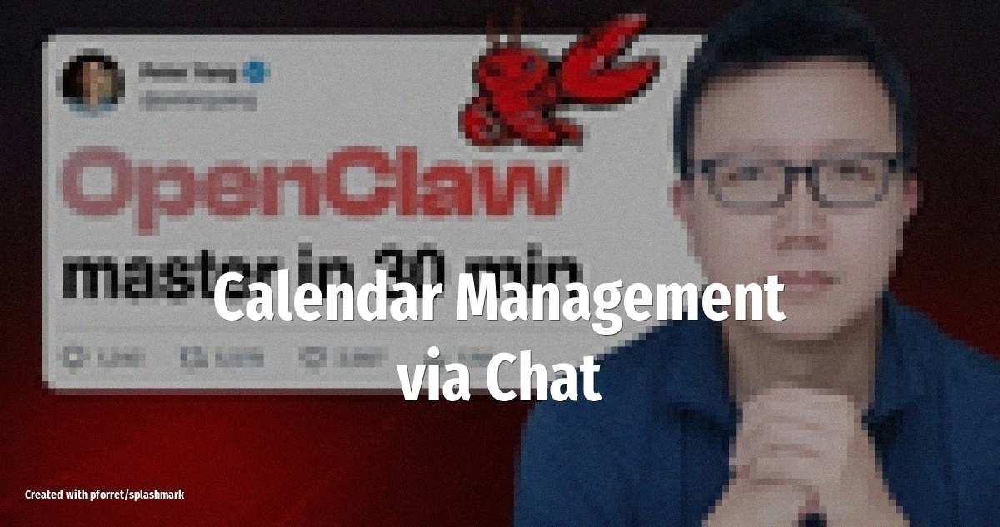

# Calendar Management via Chat

Send a WhatsApp or Telegram message like "Schedule lunch with Sarah Thursday at noon" and OpenClaw creates the Google Calendar event, sends the invite, and warns you about conflicts -- all without opening an app.

<!-- more -->

## What it does

OpenClaw connects to your Google Calendar API and listens for scheduling requests through your preferred messaging channel. The agent:

- **Parses natural-language requests** into calendar events with date, time, attendees, and location
- **Checks for conflicts** before confirming, suggesting alternative slots when overlaps exist
- **Sends invites** directly to attendees via Google Calendar
- **Blocks focus time** automatically based on your preferences (e.g. "no meetings before 10am")

## Setup overview

1. Install the **Google Calendar** skill from ClawHub
2. Configure OAuth credentials for your Google account
3. Connect OpenClaw to your WhatsApp or Telegram channel
4. Set a SOUL.md instruction like: *"When I mention a meeting, check my calendar first and warn me about conflicts"*

## LLM and tools

The original tutorial uses **Claude 4.5 Sonnet** as the brain, with Google Calendar API for the actual event management. Any model with good instruction-following works here.

## Source

Based on [Master OpenClaw in 30 Minutes](https://creatoreconomy.so/p/master-openclaw-in-30-minutes-full-tutorial) (Feb 4, 2026)
