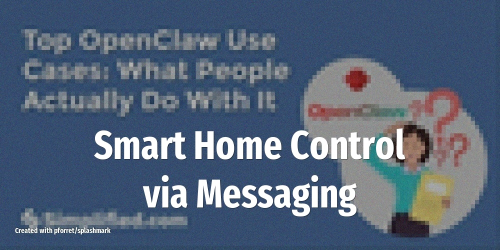

# Smart Home Control via Messaging

Text "movie mode" to your OpenClaw agent and it dims the lights, closes the blinds, turns on the TV, and sets the thermostat -- all through Home Assistant integration.

<!-- more -->

## What it does

OpenClaw acts as a natural-language bridge to your smart home. Instead of fiddling with multiple apps, you send a single message and the agent orchestrates multiple devices:

- **Scene triggers**: "movie mode", "bedtime", "leaving home" execute multi-device automations
- **Individual controls**: "Turn on porch lights at sunset", "Set thermostat to 20C"
- **Status queries**: "Is the garage door closed?", "What's the indoor temperature?"
- **Context-aware actions**: The agent can combine weather data with your preferences ("it's getting cold, bump the heat up")

## Setup overview

1. Install the **Home Assistant** skill from ClawHub
2. Generate a long-lived access token in Home Assistant
3. Map your device entities in the skill config
4. Connect via WhatsApp or Telegram for messaging control

## LLM and tools

Uses **Claude 4.5 Sonnet** or any capable model for intent parsing. The actual device control goes through the Home Assistant REST API. Setup complexity is low-medium since you need an existing Home Assistant instance.

## Source

Based on [Top 10 OpenClaw Use Cases in 2026](https://simplified.com/blog/automation/top-openclaw-use-cases) (Feb 18, 2026) and [What People Are Actually Doing With OpenClaw](https://www.forwardfuture.ai/p/what-people-are-actually-doing-with-openclaw-25-use-cases) (Feb 10, 2026)
