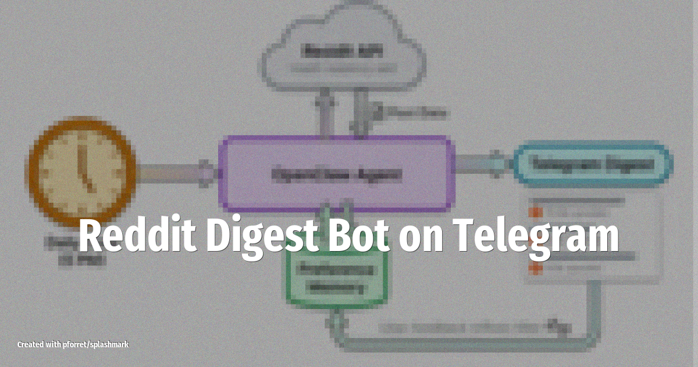

# Reddit Digest Bot on Telegram

Wake up to a Telegram message with the top posts from your favorite subreddits, filtered to topics you actually care about. Zero skills needed -- just a prompt and a cron job.

<!-- more -->

## What it does

A scheduled OpenClaw agent scans specified subreddits every morning, filters posts by relevance to your interests, and delivers a formatted digest to your Telegram chat. The agent:

- **Scans multiple subreddits** (e.g. r/selfhosted, r/LocalLLaMA, r/homeautomation)
- **Filters by keyword and relevance** using the LLM to judge what matches your interests
- **Summarizes each post** in 1-2 lines with the original link
- **Delivers at your preferred time** via a cron job (e.g. 7:00 AM)

## Setup overview

1. No special skills required -- uses a prompt-only approach with Reddit's public JSON feeds
2. Write a SOUL.md prompt describing your interests and preferred subreddits
3. Configure a cron job: `0 7 * * * openclaw run reddit-digest`
4. Connect Telegram as the delivery channel

This is the lowest-effort project to start with if you've never configured an OpenClaw cron job before.

## LLM and tools

Works well with local models like **Llama 4** via Ollama since the task is straightforward summarization. No API costs needed.

## Source

Based on [9 OpenClaw Projects to Build in 2026](https://www.datacamp.com/blog/openclaw-projects) (Feb 2026)
