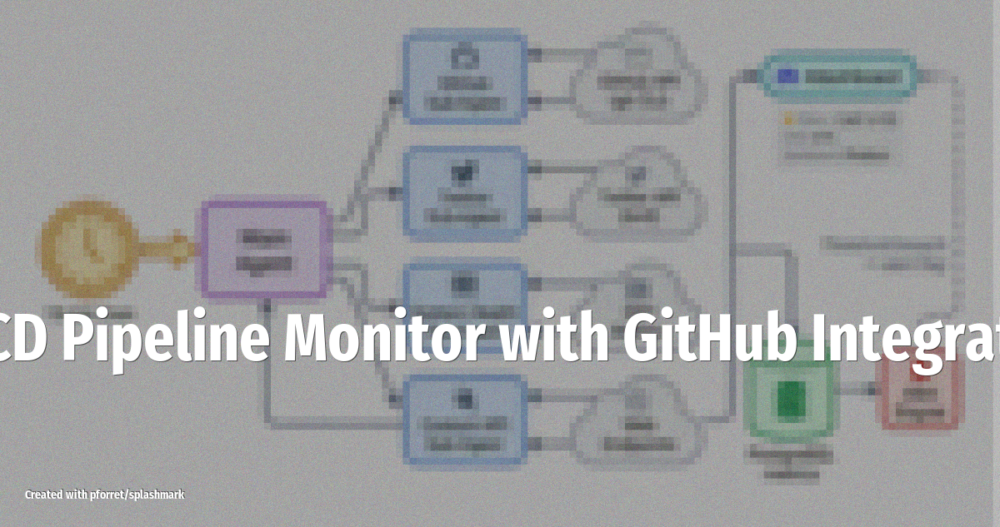

# CI/CD Pipeline Monitor with GitHub Integration

OpenClaw watches your GitHub repos, alerts on failed builds, creates issues for flaky tests, and can even open fix PRs -- all reported to Slack in real time.

<!-- more -->

## What it does

A developer-focused automation that keeps your CI/CD pipeline healthy:

- **Build monitoring**: watches GitHub Actions runs and alerts on failures within seconds
- **Flaky test detection**: tracks test results in Supabase over time, flags tests that fail intermittently
- **Auto-triage**: reads error logs and suggests root causes in the Slack notification
- **Issue creation**: opens GitHub issues with relevant logs, labels, and assignees for recurring failures
- **Fix PRs**: for common patterns (dependency bumps, linting fixes), the agent can open a PR directly

Orchestrated through n8n for complex multi-step workflows that chain GitHub, Supabase, and Slack together.

## Setup overview

1. Install the **GitHub** skill and configure a personal access token with repo scope
2. Set up **n8n** (self-hosted) or use Clawflows for orchestration
3. Optionally use **Supabase** to store historical test results for trend analysis
4. Connect **Slack** as the notification channel (use a dedicated #ci-alerts channel)
5. Configure webhook triggers from GitHub Actions

## LLM and tools

Tested with **GPT-4o** on a live VPS, with measured time-saved metrics. The n8n + Supabase stack handles the stateful orchestration; the LLM provides log analysis and natural-language summaries.

## Source

Based on [21 Advanced OpenClaw Automations for Developers](https://medium.com/@rentierdigital/21-openclaw-automations-nobody-talks-about-because-the-obvious-ones-already-broke-the-internet-3f881b9e0018) (Feb 2026) and [What People Are Actually Doing With OpenClaw](https://www.forwardfuture.ai/p/what-people-are-actually-doing-with-openclaw-25-use-cases) (Feb 10, 2026)
