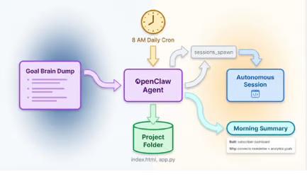

# Content Research and Publishing Pipeline

OpenClaw monitors trending topics in your niche, researches sources, drafts articles, and queues them in your CMS -- with a human-approval gate before anything goes live.

<!-- more -->

## What it does

A multi-stage content pipeline that runs mostly on autopilot:

1. **Trend monitoring**: Exa Web Search scans for trending topics in your niche daily
2. **Source gathering**: Playwright Scraper collects data from JS-heavy sites, forums, and competitor blogs
3. **Outline generation**: the LLM creates a structured outline with H2/H3 headings and target word counts
4. **Draft writing**: a full article draft with citations and internal linking suggestions
5. **CMS queuing**: pushes the draft to WordPress (or your CMS) as a pending post
6. **Human review gate**: sends you a Telegram/Slack notification with a summary and link to approve or edit

Nothing publishes without your approval.

## Setup overview

1. Install skills: **Exa Web Search**, **Playwright Scraper**, and your CMS connector
2. Write a SOUL.md prompt describing your niche, tone, target audience, and content guidelines
3. Configure a daily cron for trend scanning
4. Set up a Clawflow: scan -> research -> outline -> draft -> queue -> notify
5. Connect Telegram or Slack for the approval notification

## LLM and tools

Requires **Claude 4.5 Sonnet** for high-quality long-form writing. Exa handles search, Playwright handles scraping pages that block simple HTTP requests. The key insight: always keep the human-approval gate for publishing.

## Source

Based on [Top 10 OpenClaw Use Cases in 2026](https://simplified.com/blog/automation/top-openclaw-use-cases) (Feb 18, 2026)
