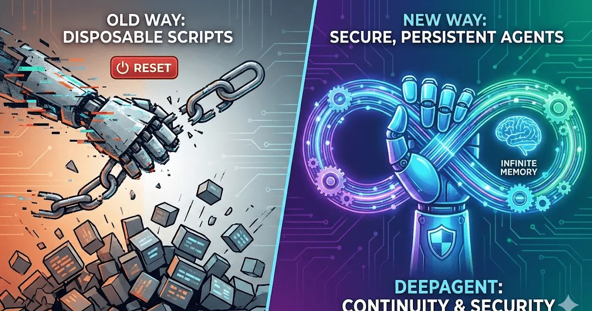

# Invoice Monitor That Learns Customer Patterns

An OpenClaw agent monitors overdue invoices on a schedule, remembers how each customer typically responds, and adapts its follow-up tone and timing accordingly -- turning collections into a persistent, intelligent process.

<!-- more -->

## What it does

Unlike a simple reminder bot, this agent builds up knowledge over time:

- **Scheduled invoice scanning** via cron checks for overdue payments daily
- **Customer memory**: remembers that Client A always pays after the second reminder, while Client B needs a phone call
- **Adaptive follow-ups**: adjusts email tone (friendly nudge vs. formal notice) based on payment history
- **Escalation logic**: auto-escalates to you via Telegram when an invoice passes a threshold (e.g. 30 days overdue)
- **Pattern detection**: flags unusual behaviour ("Client C usually pays on time but is now 2 weeks late")

## Setup overview

1. Install the **AgentMail** skill for sending follow-up emails from a managed identity
2. Connect your invoicing system (Stripe, QuickBooks, or a spreadsheet)
3. Enable **persistent memory** in OpenClaw so the agent retains context across sessions
4. Configure a daily cron job: `0 9 * * 1-5 openclaw run invoice-check`
5. Connect Telegram for escalation alerts

## LLM and tools

Requires **Claude 4.5 Sonnet** for its strong reasoning about customer patterns and tone adjustment. The persistent memory system is the key differentiator -- this is where OpenClaw's "infinite memory" architecture shines.

## Source

Based on [Secure OpenClaw With Infinite Memory Is the First Time Agents Feel Real](https://www.revolutioninai.com/2026/02/secure-openclaw-with-infinite-memory-is-the-first-agents-feel-real.html) (Feb 20, 2026)
