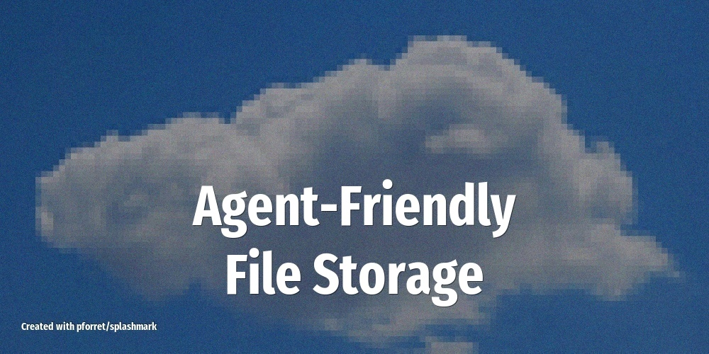

# Build Your Own Agent-Friendly File Storage

When OpenClaw can't easily talk to an existing service, sometimes the fastest path is to build a simple replacement your agent can actually use.

<!-- more -->

## What it does

As [Jesse Genet shared](https://x.com/jessegenet/status/2026049619218862321): *"If you're struggling to get your OpenClaw to use an existing service, just build a replacement. In one morning we built a working photos/drive replacement and that's my default file storage now."*

Instead of wrestling with complex OAuth flows and API limitations of Google Drive or iCloud, you build a lightweight file storage service that your OpenClaw agent can read from and write to natively. The result:

- **File upload and retrieval** via a simple API your agent can call directly
- **Photo library browsing** with metadata search (date, tags, location)
- **Folder organization** that the agent manages on your behalf
- **Google Takeout import** to migrate your existing files from Google Photos and Drive

## Setup overview

1. Set up a simple storage backend -- a VPS with an API layer, or a self-hosted solution like MinIO or Nextcloud
2. Expose a REST API with basic endpoints: upload, download, list, search, tag
3. Write a custom OpenClaw skill that wraps these API calls
4. Write a SOUL.md prompt defining how the agent should organize, tag, and retrieve files
5. Import your existing data from [Google Takeout](https://takeout.google.com) to populate the library

## LLM and tools

Uses **Claude 4.5 Sonnet** for understanding natural-language file requests ("find that sunset photo from last Tuesday") and organizing files intelligently. The custom skill handles the actual API calls to your storage backend.

## Tips

- **Start with Google Takeout**: export your Google Photos and Drive data from [takeout.google.com](https://takeout.google.com) to seed your new storage with existing files
- **Keep the API simple**: your agent doesn't need a complex file system -- basic CRUD plus search by name/date/tag covers most use cases
- **Add thumbnail generation**: makes it easy for the agent to describe or identify photos when you ask about them
- **Don't over-engineer**: a morning's worth of work is the right scope -- if it takes longer, you're building too much

## Source

Based on [@jessegenet on X](https://x.com/jessegenet/status/2026049619218862321) (Feb 23, 2026)
