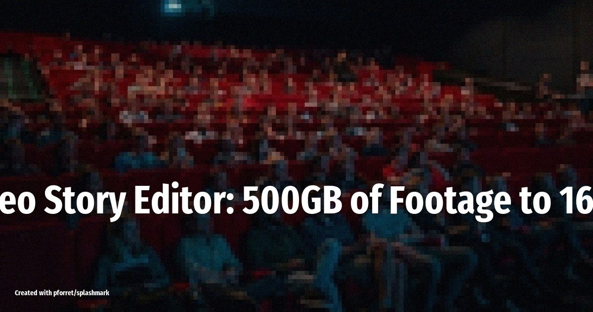

# AI Video Story Editor: 500GB of Footage to 16 Films

OpenClaw orchestrates Gemini, Mistral, and Claude to turn raw travel footage into story-edited films with narrative arcs, editor notes, and FCPXML timelines -- ready for Final Cut Pro or DaVinci Resolve.

<!-- more -->

## What it does

As [Xitij Ritesh Patel shared](https://x.com/xitijpatel/status/2026025051573686429): *"Last night, my OpenClaw assistant Vanessa turned all of it into 16 story-edited films. Narrative arcs, emotional beats, editor notes on every clip. Took about 90 minutes."*

The agent takes a massive library of raw video footage and produces complete story edits:

- **Timeline per day** (10-15 minutes each) with actual story structure
- **Story treatment** for each day describing the narrative arc
- **Editor notes on every clip** explaining why it's included
- **Highlight markers** for trailer-worthy shots
- **Full transcripts** of every conversation
- **Quality and story scores** for every clip

All output as **FCPXML**, which opens directly in Final Cut Pro or DaVinci Resolve. No proprietary format lock-in.

## The multi-agent architecture

This is a true multi-model orchestration. OpenClaw coordinates 16 parallel agents, each independently building a narrative arc for one day of the trip:

1. **Gemini Flash** analyzes the video content -- scenes, subjects, composition, visual quality
2. **Mistral Voxtral** transcribes all audio and conversations
3. **Claude Opus 4.6** handles the narrative story editing -- assembling clips into coherent arcs with emotional beats

OpenClaw acts as the orchestrator, routing tasks to the right model and merging results into final FCPXML output.

## Setup overview

1. Install OpenClaw with the relevant skills for video file access
2. Set up model access: Gemini Flash, Mistral Voxtral, and Claude Opus
3. Write a SOUL.md prompt describing your editing style, story preferences, and output format
4. Point the agent at your footage directory
5. The agent spawns parallel workers per day/segment and assembles the results

The tech stack: **Python** + **FFmpeg** for video processing, **FCPXML** for NLE-compatible output.

## The economics

| Approach | Cost | Time |
|---|---|---|
| Hire an editor | $3,000 - $5,000 | Days to weeks |
| Do it yourself | Your sanity | 40 - 80 hours |
| OpenClaw multi-agent | ~$25 in API costs | ~90 minutes |

As Xitij puts it: *"I'm not replacing editors. I'm replacing the assembly edit. The part nobody wants to do."*

The agent handles the tedious first pass -- logging, selecting, assembling, scoring. A human editor can then take the FCPXML timeline and refine it into a polished final cut in a fraction of the usual time.

## Tips

- **Use the right model for each job**: vision models for video analysis, speech models for transcription, reasoning models for narrative editing -- don't try to do everything with one LLM
- **Parallelize by segment**: splitting footage into independent chunks (days, scenes, locations) lets you run agents in parallel for massive speed gains
- **FCPXML is the key**: outputting to an open timeline format means editors can pick up exactly where the AI left off in their preferred NLE
- **Keep humans in the loop**: the AI does the assembly edit, but the creative polish still benefits from a human touch

## Source

Based on [@xitijpatel thread on X](https://x.com/xitijpatel/status/2026025051573686429) (Feb 23, 2026)
