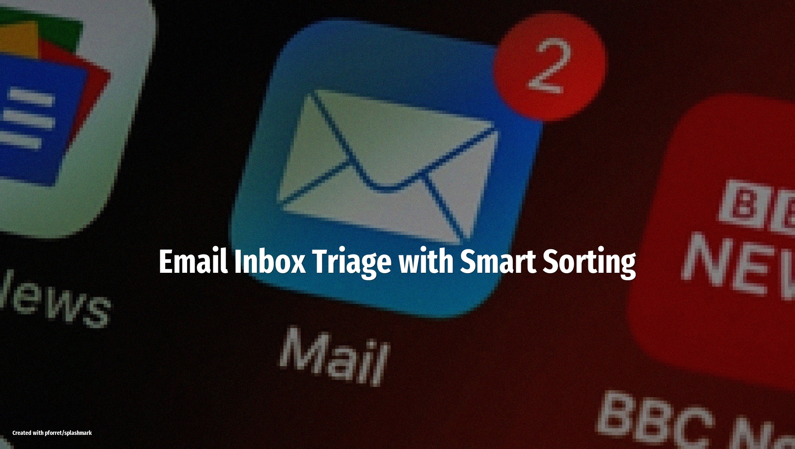

# Email Inbox Triage with Smart Sorting

Let OpenClaw read your inbox, sort messages by urgency, draft replies to routine emails, and auto-unsubscribe from newsletters you never open.

<!-- more -->

## What it does

The agent connects to your Gmail or Outlook inbox and processes incoming messages on a schedule:

- **Urgency classification**: labels each email as urgent, normal, or low-priority based on sender, subject, and content
- **Auto-reply drafts**: generates polite responses to routine requests (meeting confirmations, acknowledgments, info requests) and saves them as drafts for your review
- **Newsletter cleanup**: identifies marketing emails and newsletters you haven't opened in 30+ days and auto-unsubscribes
- **Daily digest**: sends a Slack or Telegram summary of what arrived, what was handled, and what needs your attention

## Setup overview

1. Install the **Gmail** skill (or Outlook equivalent) from ClawHub
2. Optionally install **Slack** or **Telegram** for digest delivery
3. Write a SOUL.md prompt with your urgency rules: VIP senders, keywords that escalate priority, categories to auto-archive
4. Configure cron: `*/30 * * * * openclaw run inbox-triage` (every 30 minutes during work hours)
5. Review auto-reply drafts before sending -- the agent never sends without your approval

## LLM and tools

Uses **Claude 4.5 Sonnet** for classification and reply drafting. The Gmail API handles reading and labeling. Keep your email credentials locked down -- grant the narrowest OAuth scope possible and audit the agent's actions weekly.

## Source

Based on [25 OpenClaw Automation Ideas You Need to Try](https://openclawready.com/blog/openclaw-automation-ideas/) (Feb 15, 2026), [Top 10 OpenClaw Use Cases in 2026](https://simplified.com/blog/automation/top-openclaw-use-cases) (Feb 18, 2026), and [What People Are Actually Doing With OpenClaw](https://www.forwardfuture.ai/p/what-people-are-actually-doing-with-openclaw-25-use-cases) (Feb 10, 2026)
