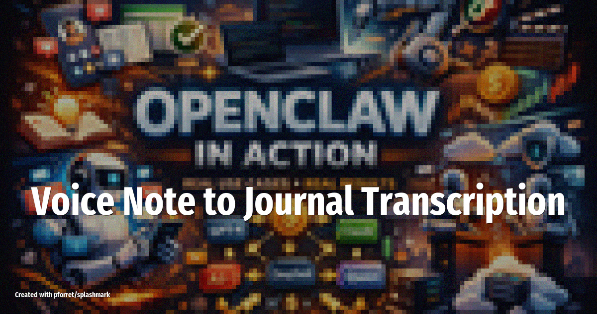

# Voice Note to Journal Transcription

Send a voice memo to WhatsApp or Telegram and OpenClaw transcribes it, cleans it up, extracts action items, and saves a structured journal entry to Notion.

<!-- more -->

## What it does

The agent turns rambling voice notes into organized, searchable journal entries:

- **Transcribes audio** using Whisper, handling accents, filler words, and background noise
- **Cleans up the text**: removes false starts, organizes scattered thoughts into coherent paragraphs
- **Extracts action items** and adds them as checkbox tasks
- **Tags entries** by topic (work, personal, ideas, health) based on content
- **Saves to Notion** as a dated journal page with mood detection and a one-line summary

## Setup overview

1. Install the **Whisper** skill for speech-to-text
2. Install the **Notion** skill for journal storage
3. Connect WhatsApp or Telegram as the input channel
4. Write a SOUL.md prompt specifying your journal format, tagging categories, and how you want action items handled
5. Send a voice note any time -- the agent processes it within minutes

## LLM and tools

Uses **Claude 4.5 Sonnet** for text cleanup, summarization, and tagging. Whisper handles the transcription. Your voice notes may contain sensitive personal content -- make sure your Notion workspace and API keys are secured, and consider whether you want the LLM provider to retain the transcription data.

## Source

Based on [OpenClaw Use Cases: 35+ Real Ways People Are Running Their Lives](https://sidsaladi.substack.com/p/openclaw-use-cases-35-real-ways-people) (Feb 22, 2026)
