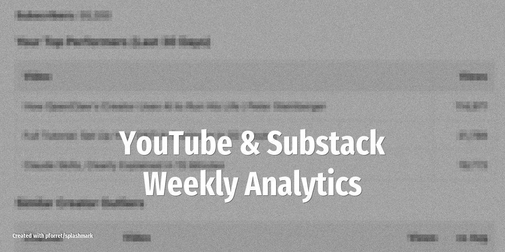

# Weekly YouTube and Substack Analytics Reports

Get a weekly performance digest for your creator channels -- subscriber growth, top-performing content, engagement trends, and actionable suggestions -- delivered straight to Telegram.

<!-- more -->

## What it does

The agent pulls analytics from your creator platforms and compiles a weekly report:

- **YouTube metrics**: views, watch time, subscriber changes, top 5 videos by engagement, audience retention drop-off points
- **Substack metrics**: open rates, click-through rates, new subscribers, most-shared posts
- **Cross-platform comparison**: which topics perform well on both platforms vs. platform-specific winners
- **Content suggestions**: based on trending topics in your niche and your historical best performers
- **Growth tracking**: week-over-week and month-over-month trend lines

## Setup overview

1. Install the **YouTube** skill with read-only analytics access
2. Connect Substack via API or use Playwright for dashboard scraping
3. Install **Telegram** for report delivery
4. Write a SOUL.md prompt defining which metrics matter, your growth targets, and the report format
5. Configure cron: `0 9 * * 1 openclaw run creator-analytics` (Mondays at 9 AM)

## LLM and tools

Uses **Claude 4.5 Sonnet** for data interpretation and content recommendations. The YouTube Data API provides channel analytics. For Substack, use their API or the Playwright skill to scrape your dashboard. Keep API tokens scoped to read-only access.

## Source

Based on [Master OpenClaw in 30 Minutes: Safe Setup + 5 Real Use Cases + Memory](https://creatoreconomy.so/p/master-openclaw-in-30-minutes-full-tutorial) (Feb 4, 2026)
