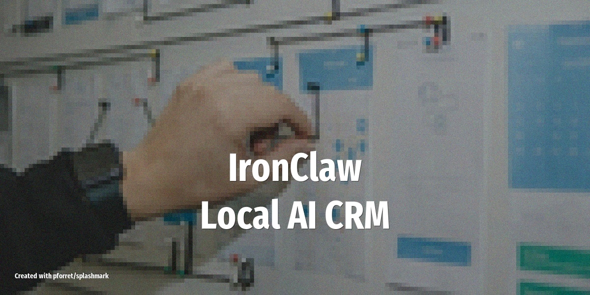

# IronClaw: Local AI CRM for Lead Enrichment and Outreach

Run a full AI-powered sales pipeline on your Mac -- scrape founder directories, enrich contacts with LinkedIn data, send personalized outreach, and track conversions -- all locally with IronClaw.

<!-- more -->

## What it does

IronClaw is an OpenClaw fork purpose-built for CRM and outreach automation. Instead of building a CRM layer on top of OpenClaw manually, IronClaw ships with it pre-built:

- **Scrapes founder directories** like YC batches, pulling names, companies, LinkedIn profiles, and education into a local DuckDB database
- **Enriches contacts** with LinkedIn profile data, email addresses, and company details -- using your existing Chrome profile for authentication
- **Generates personalized outreach** messages tailored to each contact's background and company
- **Runs follow-up sequences** on cron schedules (LinkedIn connection request, then email, then second email at 3-day intervals)
- **Tracks pipeline stages** from New Lead through Contacted, Qualified, and Converted with live analytics

## How it differs from OpenClaw

OpenClaw is a general-purpose AI agent gateway -- you can build anything, but you design the structure yourself. IronClaw narrows the scope to one workflow done well:

| | OpenClaw | IronClaw |
|---|---|---|
| **Scope** | Multi-agent orchestration, 15+ messaging channels | CRM, lead enrichment, outreach |
| **Setup** | Flexible, you build your own pipeline | Pre-built dashboards and pipeline stages |
| **Browser** | Playwright skill for scraping | Uses your real Chrome profile (cookies, sessions) |
| **Database** | Memory files | DuckDB with structured tables (contacts, companies, founders) |
| **Platform** | Linux, macOS, Windows (WSL) | Mac-first |

## Setup overview

1. Install IronClaw: `curl -fsSL https://ironclaw.sh/install.sh | bash` -- opens at `localhost:3100`
2. Connect your Chrome profile -- IronClaw detects active auth sessions (LinkedIn, Gmail, GitHub)
3. Import existing contacts from Google Drive, Notion, Salesforce, HubSpot, or CSV
4. Define your outreach sequence in the SOUL.md: target criteria, message templates, follow-up cadence
5. Set up cron schedules for enrichment runs and follow-up sequences

## LLM and tools

Uses **Claude** (or any OpenAI-compatible endpoint via OpenRouter, Ollama, or vLLM) for generating personalized messages, analyzing lead quality, and summarizing pipeline status. DuckDB handles structured data queries -- ask questions in plain English and IronClaw translates to SQL. Chrome profile integration provides seamless LinkedIn and email access without re-authentication.

## Tips

- **Start with a small batch** (20-30 contacts) to tune your outreach message templates before scaling
- **Review generated messages** before enabling auto-send -- the AI adapts to your style over time but needs initial feedback
- **Use the analytics dashboard** to track reply rates per message variant and adjust your approach
- **Set respectful sending limits** -- LinkedIn has daily connection request caps, and aggressive outreach gets flagged
- **Export pipeline data** periodically; DuckDB files are portable and easy to back up

## Source

Based on [IronClaw -- AI CRM, hosted locally on your Mac](https://ironclaw.sh/) (2026), [OpenClaw vs Ironclaw Comparison](https://juliangoldie.com/openclaw-vs-ironclaw-comparison/) (Feb 23, 2026), and [DenchHQ/ironclaw on GitHub](https://github.com/DenchHQ/ironclaw) (2026)
