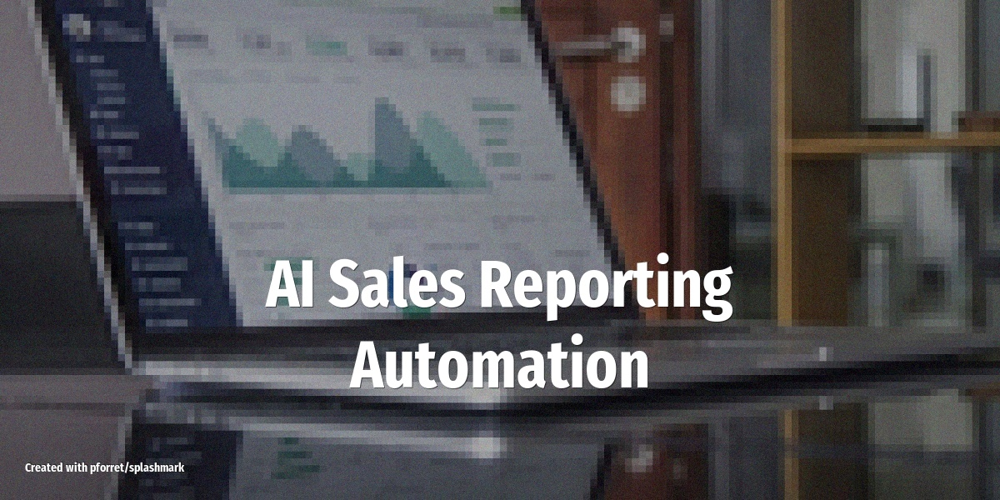

# AI Sales Reporting Automation

Generate weekly sales reports at 6 AM Monday -- pulling live CRM data, writing executive summaries with Claude, and delivering audience-specific reports to Slack -- while your ops team sleeps.

<!-- more -->

## What it does

The agent replaces the Monday morning reporting grind (typically 7+ hours of manual work per week):

- **Pulls pipeline data** from HubSpot, Salesforce, or BigQuery at scheduled times
- **Calculates key metrics** automatically: total pipeline, forecast, week-over-week change, closed deals, rep leaderboard
- **Generates executive narratives** using Claude -- specific, direct commentary that calls out deal names, rep names, and risks
- **Formats for different audiences**: CRO gets a high-level summary, sales managers get rep performance and coaching opportunities, ops gets granular data quality and bottleneck analysis
- **Delivers to Slack** with rich formatting, metric cards, and action buttons before anyone's awake
- **Monitors in real-time** for pipeline changes: deal stage regressions, close date pushes >14 days, new large deals >$200K

## Setup overview

1. Install the **Slack** skill and connect your CRM API (HubSpot or Salesforce credentials)
2. Optionally connect a data warehouse (BigQuery, Snowflake) for historical trend data
3. Write a `SOUL.md` defining your report structure, audience channels, and alert thresholds
4. Configure cron schedules:
    - `0 6 * * 1` -- Monday 6 AM weekly report
    - `0 7 * * *` -- Daily 7 AM pipeline snapshot (only posts if >5% movement)
    - `0 16 * * 5` -- Friday 4 PM week preview with at-risk deals

## LLM and tools

Uses **Claude 4.5 Sonnet** for narrative generation and audience-specific formatting. The agent pulls deal data via CRM APIs, runs calculations in shell, and posts to Slack with Block Kit formatting. Real-time monitoring runs every 15 minutes, comparing pipeline snapshots and alerting on significant changes.

## ROI

| Task | Manual | Automated | Weekly savings |
|---|---|---|---|
| Data gathering | 2 hrs | 0 | 2 hrs |
| Formatting | 1.5 hrs | 0 | 1.5 hrs |
| Writing commentary | 1 hr | 5 min | 55 min |
| Distribution | 30 min | 0 | 30 min |
| Ad-hoc requests | 2 hrs | 15 min | 1.75 hrs |
| **Total** | **7 hrs** | **20 min** | **6.7 hrs/week** |

At $75/hr fully loaded: **$26,100/year saved** per ops person.

## Tips

- **Run parallel for 2 weeks** -- generate AI reports alongside manual ones to build confidence before switching over
- **Start with one audience** (e.g. CRO weekly report) before adding manager and ops views
- **Tune the alert thresholds** -- too many real-time alerts cause alert fatigue; start conservative ($100K+ deals, >14 day pushes)
- **Map your current reports first** -- document what you send, to whom, and when, then replicate that structure in your SOUL.md
- **Add deal context** by connecting the agent to your meeting notes or call transcription tool for richer commentary

## Source

Based on [AI Sales Reporting Automation with OpenClaw](https://marketbetter.ai/blog/ai-sales-reporting-automation-openclaw/) (Feb 10, 2026)
