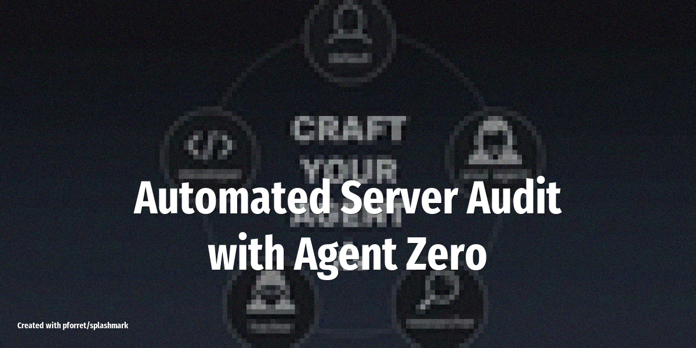

# Automated Server Audit with Agent Zero

Let Agent Zero SSH into your servers, run security checks, and deliver a prioritized vulnerability report to Slack -- no pre-built scripts required, because the agent writes its own tools on the fly.

<!-- more -->



## What it does

Agent Zero connects to your servers via SSH and performs a full security audit autonomously. Unlike OpenClaw, which relies on pre-installed skills, Agent Zero dynamically creates and executes the tools it needs:

- **Scans open ports** using `nmap` or `ss` and flags unexpected listeners
- **Checks for outdated packages** by querying the system package manager and comparing against known CVE databases
- **Reviews firewall rules** and highlights overly permissive configurations
- **Inspects SSH config** for weak settings (password auth enabled, root login, outdated key algorithms)
- **Generates a prioritized report** with critical/high/medium/low findings and recommended fixes
- **Posts the summary to Slack** with the full report attached as a file

## Why Agent Zero instead of OpenClaw?

Agent Zero's "computer as a tool" architecture makes it a natural fit for infrastructure work. Instead of installing separate skills for each check, the agent writes shell commands, scripts, and even Python tools on the fly based on what it discovers. It adapts to each server's OS and package manager without preconfiguration.

OpenClaw would need dedicated skills for port scanning, package auditing, and firewall inspection. Agent Zero handles all of this through its terminal access and dynamic tool creation.

## Setup overview

1. Install Agent Zero from [github.com/agent0ai/agent-zero](https://github.com/agent0ai/agent-zero)
2. Configure an LLM provider (Claude, GPT-4o, or a local model via Ollama)
3. Add your server SSH credentials to the agent's environment
4. Set up the Slack webhook for report delivery
5. Create a prompt defining your audit scope and severity thresholds

## Example prompt

```
Audit the server at 10.0.1.50 via SSH. Check for:
- Open ports that shouldn't be exposed (only 22, 80, 443 expected)
- Packages with known CVEs
- Firewall rules allowing unrestricted inbound traffic
- SSH hardening (disable password auth, no root login)
- File permissions on /etc/shadow, /etc/passwd

Prioritize findings as critical/high/medium/low.
Post a summary to Slack #infra-alerts with the full report attached.
```

## How Agent Zero handles it

The agent breaks the task into subtasks using its multi-agent hierarchy:

1. **Subordinate agent 1** runs port and network checks
2. **Subordinate agent 2** handles package and CVE analysis
3. **Subordinate agent 3** audits SSH and file permissions
4. The **main agent** consolidates findings, assigns severity, and formats the Slack report

Each subordinate writes its own shell commands and scripts as needed -- no pre-built tooling required. Results are stored in Agent Zero's memory so subsequent audits can track changes over time.

## LLM and tools

Works best with **Claude 4.5 Sonnet** or **GPT-4o** for reasoning about security configurations. Local models via Ollama can handle the simpler subtasks (port listing, package version comparison) to reduce API costs. Agent Zero's built-in terminal execution and memory handle the rest.

## Tips

- **Start with a staging server** to validate the agent's audit logic before running on production
- **Restrict SSH access** -- use a dedicated audit key with read-only sudo permissions
- **Schedule weekly audits** by running Agent Zero from a cron job and comparing reports over time
- **Review generated scripts** before enabling auto-remediation -- let the agent report first, fix later
- **Combine with OpenClaw** if you want the audit triggered from a chat message: use OpenClaw as the messaging frontend that kicks off the Agent Zero audit
